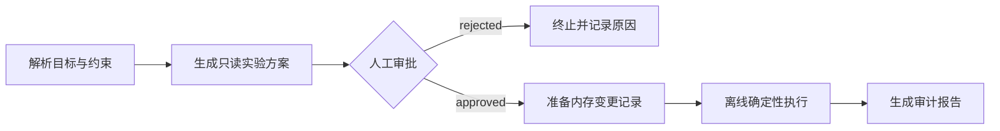

# Research Agent：可审计的人机协同研究工作流

## 项目定位

这个模块回答一个具体问题：如何把“提出实验—人工审核—准备变更—执行—复盘”组织成一条可暂停、可恢复、可审计的研究工作流。

代码根据实际模型调优流程中的通用方法重新整理，保留显式状态、条件路由、人工审批和审计事件。公开版本不包含原工程的 API Key、本机路径、运行日志、模型权重或非公开数据，也不依赖外部 LLM 和 Claude CLI。

## 工作流结构



审批门是执行边界，不是展示用的确认按钮：

- 方案生成阶段只读取目标和约束。
- `approved` 是进入变更适配器的唯一条件边。
- `rejected` 直接进入终止态，不能调用变更或执行适配器。
- 每个状态变化都会追加带序号的 `AuditEvent`。
- 终止状态不能再次审批，避免通过重复调用绕过路由。

## 离线适配器

公开演示提供四个无网络适配器：

| 适配器 | 职责 | 公开版本行为 |
|---|---|---|
| `DeterministicPlanner` | 生成实验方案 | 固定生成基线与单变量对照实验 |
| `InMemoryMutationAdapter` | 准备变更 | 只生成声明式记录，不修改文件 |
| `DeterministicExecutor` | 执行实验 | 根据输入生成稳定的合成指标，不训练模型 |
| `MarkdownReporter` | 汇总结果 | 输出带免责声明的审计报告 |

合成指标只用于验证工作流的确定性，不是历史实验结果，也不能用于证明模型性能。

## 运行

```bash
pip install -e '.[test]'
python examples/run_research_agent.py
pytest tests/test_research_agent.py
```

示例会分别运行拒绝和批准分支。拒绝分支中的 `mutations` 与 `executions` 必须同时为 0；批准分支才会生成变更记录、离线执行结果和报告。

## 核心接口

```python
from ai_research_portfolio.research_agent import ResearchWorkflow

workflow = ResearchWorkflow.offline()
pending = workflow.start(
    "Evaluate one controlled model change.",
    constraints=("Keep the data split and labels fixed.",),
)

# 工作流在这里暂停，等待明确的人类决定。
completed = workflow.review(
    pending,
    "approved",
    feedback="Proceed with the fixed protocol.",
)
```

`WorkflowState.to_dict()` 会生成 JSON 兼容字典，可作为 LangGraph 等图编排框架的共享状态。`route_after_review()` 对应条件边，返回 `approval`、`mutation` 或 `end`。核心状态机不绑定具体框架，因此在没有 LangGraph 的环境里也能运行和测试。

## LangGraph 适配器

`langgraph_adapter.py` 提供可运行的 `StateGraph`，使用 `MemorySaver` 保存线程状态，并在审批节点调用真正的 `interrupt()`。首次执行会暂停；调用方通过 `Command(resume={...})` 传入 `approved` 或 `rejected` 后恢复。拒绝分支直接连到 `END`，批准分支才会进入变更、执行和报告节点。

```bash
pip install -e '.[agent,test]'
python examples/run_langgraph_agent.py
pytest tests/test_langgraph_adapter.py
```

适配器的状态只包含 JSON 兼容的字符串、列表和字典，可由持久化 checkpointer 保存。公开示例仍使用内存变更与合成指标，不修改文件，也不调用外部模型。

## 测试覆盖的安全性质

`tests/test_research_agent.py` 不只检查输出，还验证控制流：

1. 工作流启动后停在 `awaiting_approval`，此时没有任何变更或执行记录。
2. 拒绝审批后，spy 变更适配器和执行适配器的调用次数均为 0。
3. 拒绝分支不会出现 `mutation.prepared` 或 `execution.completed` 审计事件。
4. 只有批准分支能依次进入变更、执行和报告阶段。
5. 同样的目标与约束会生成完全一致且可序列化的状态。

## 工程边界

真实系统可以将离线适配器替换为 LLM 规划器、沙箱代码编辑器和训练执行器，但应继续保留以下约束：

- 密钥只从运行环境读取，不能写入仓库或日志。
- 文件变更必须在隔离工作区内完成，并配置可编辑文件白名单。
- 训练前应执行语法、数据协议和信息泄漏检查。
- 命令、diff、指标和失败原因需要进入审计链。
- 人工拒绝必须是终止路由，不能在异常恢复时默认改为批准。

当前公开版本用于展示 Agent 编排、Human-in-the-loop 和评测安全意识，不宣称具备无人值守的自动研究能力。
